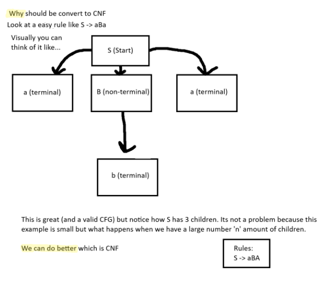
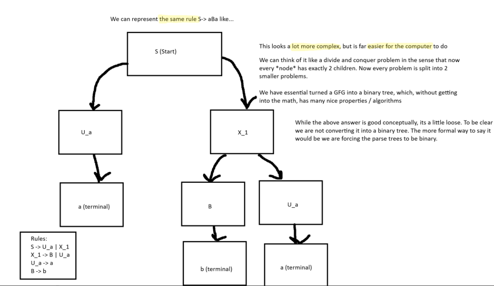

# COMP 382 Assignment 2 
# Group 9 Topic 5
# Ishwak, Darius, Ryan, Brayden

CFG to CNF Converter is a Python program that converts Context-Free Grammars into Chomsky Normal Form. 

## Features implemented

- Epsilon Removal
- Unit Production Removal
- Terminal Normalization
- Binary Decomposition
- Validation

## Conversion Process

The program follows 4-steps:
1. _step_new_start: Create a new start symbol (S0).
2. _step_remove_epsilon: Eliminate empty productions and update rules.
3. _step_remove_unit: Replace unit rules (A -> B) with the actual contents of B.
4. _step_remove_form: Split long rules into binary form.

## Why bother converting?
# Simple Visual example



## Project Structure

```text
COMP382_assignment_2/
├── src/
│   ├── grammar.py            # Base Grammar class and parsing logic
│   ├── CGFToCNFConverter.py  # CNF conversion algorithm implementation
│   ├── main.py               # Main entry point with test cases
|
├── tests/
│   └── test_converter.py     # Unit tests for conversion steps
├── README.md                 
└── setup.sh                  
```

## Installation
1. Clone the repository. 
2. Ensure you have Python 3.x installed. 
3. Pytest for test cases (optional)

```bash
git clone https://github.com/your-repo/COMP382_assignment_2.git
cd COMP382_assignment_2
```

## Output
Before
```  
  S0 -> S
  A -> bA | ε
  B -> b | S | a
  S -> aAB | BA
```
Converted
```  
  S0 -> U_aX_1 | U_aB | BA | b | a
  A -> U_bA | b
  B -> b | U_aX_1 | U_aB | BA | a
  S -> U_aX_1 | U_aB | BA | b | a
  U_a -> a
  U_b -> b
  X_1 -> AB
```  

## Vlog Link
(add here when complete)

## References

"Chomsky Normal Form." *Tutorialspoint*, www.tutorialspoint.com/automata_theory/chomsky_normal_form.htm.

"Context-Free Grammars." *Stanford University CS 103*, 2014, web.stanford.edu/class/archive/cs/cs103/cs103.1142/lectures/17/Small17.pdf.

"CYK Algorithm." *Wikipedia*, Wikimedia Foundation, en.wikipedia.org/wiki/CYK_algorithm.

Lange, Martin, and Hans Leiß. "To CNF or not to CNF? An Efficient Yet Presentable Version of the CYK Algorithm." *Centrum für Informations- und Sprachverarbeitung, LMU Munich*, 2009, www.cis.uni-muenchen.de/download/publikationen/09cnf.pdf.

"pytest: Helps You Write Better Programs." *pytest Documentation*, docs.pytest.org/en/stable/.

"PyScript." *PyScript*, Anaconda, pyscript.net/.

Rogaway, Phillip. "CYK Algorithm." *UC Davis Department of Computer Science*, 2012, www.cs.ucdavis.edu/~rogaway/classes/120/winter12/CYK.pdf.

Sipser, Michael. *Introduction to the Theory of Computation*. 3rd ed., Cengage Learning, 2013.

